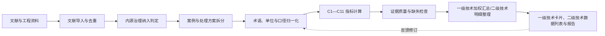

# 湖泊内源治理技术评价系统：设计与实施方案

**版本：** V0.3（通用版方案稿）  
**评价依据：** `指标体系202609.xlsx` 中的 C1—C11 指标体系  
**适用对象：** 湖泊底泥内源污染治理技术及其子技术、材料、装备和工程案例，包括原位钝化、疏浚、原位覆盖、曝气、控藻等

## 1. 建设目标

本系统不是“存放论文的数据库”，而是一个将异构文献证据转换为可审核、可比较、可评价的湖泊内源治理技术证据系统。

系统要回答四类问题：

1. 哪些文献或工程案例真正属于内源治理，而非单纯外源截污、材料制备或一般生态修复？
2. 在什么湖泊条件、技术类型、关键工艺参数和实施尺度下，各类内源治理技术表现出怎样的效果？
3. 这些效果如何映射为正式指标体系的 C1—C11？
4. 基于现场性、持续时间、对照设计和数据完整性，各类内源治理技术的评价结论有多可靠？

系统的最终输出不是一个脱离证据的“总分”，而是：

> 每个标准一级技术的一张技术评价卡，以及其所属二级技术的证据数据列表。一级技术卡片呈现 C1—C11 的证据等级加权结果、数据完整率、适用边界和风险提示；二级技术列表保留逐条结果及证据等级。

## 2. 评价边界与技术定义

### 2.1 湖泊内源治理技术的操作性定义

本系统将“湖泊内源治理技术”定义为：

> 在湖泊水体—沉积物体系中，通过移除、覆盖、固定、氧化调控、生态或物理化学干预等措施，减少底泥内源污染物存量、降低其活性或阻断其向上覆水释放，并改善相关水质与生态风险的技术。

本通用版覆盖但不限于原位钝化、疏浚、原位覆盖、曝气/增氧、控藻及其复合技术。单纯外源截污、与内源负荷无明确关系的水体净化或一般生态修复不自动纳入核心评价库。

### 2.2 文献/案例纳入规则

一条记录只有同时满足下列前 3 项时，才纳入“核心内源治理评价库”；第 4 项用于划分证据等级。

| 判定问题 | 是 | 否 |
|---|---|---|
| 是否以底泥内源污染物控制或其引发的水质/生态风险控制为目标？ | 继续判定 | 不纳入核心库 |
| 是否在水体—底泥体系中实施可识别的治理措施？ | 继续判定 | 不纳入核心库 |
| 是否有减少内源污染物存量、降低活性、削减释放通量或阻断其影响的明确机制/结果？ | 纳入 | 作为关联资料或排除 |
| 是否为真实湖泊工程、围隔、中试或原泥/原水试验？ | 记录研究尺度 | 仅作为技术机理证据 |

### 2.3 处理分类

| 分类 | 系统处理方式 |
|---|---|
| 核心内源治理技术 | 进入 C1—C11 评价流程 |
| 内源治理复合技术 | 进入评价，但单独记录各技术模块及协同措施 |
| 关联技术 | 保留在资料库，不进入内源治理核心评分 |
| 材料/装备/机理研究 | 保留作为作用机理和风险支撑，不代表工程效果 |
| 不相关技术 | 排除，并记录排除原因 |

## 3. 正式评价指标

评价主键统一使用 C1—C11；任何旧版 A/B 编码仅可作为历史来源信息，不作为系统计算主键。

| 准则层 | 指标代码 | 正式指标 | 内源治理技术的取值原则 |
|---|---|---|---|
| B1 内源负荷削减 | C1 | 底泥总氮去除率 | 仅采用底泥总氮的可核验前后或对照数据 |
|  | C2 | 底泥总磷去除率 | 仅采用底泥总磷数据；活性磷/形态转化另存为支撑指标，不替代 C2 |
|  | C3 | 营养盐释放通量削减率 | 内源治理的核心效能指标，优先采用同期对照结果 |
| B2 水质改善 | C4 | 透明度提升率 | 记录观测期、天气/藻类条件和对照信息 |
|  | C5 | 上覆水总氮去除率 | 优先采用同期对照校正结果 |
|  | C6 | 上覆水总磷去除率 | 优先采用同期对照校正结果 |
| B3 适用性 | C7 | 技术成熟度 | 基于工程尺度、案例数、最大规模和最长跟踪期评分 |
|  | C8 | 技术稳定性 | 基于效果保持率、持续时间及扰动后的保持性评分 |
|  | C9 | 环境影响 | 基于材料/设备影响、水化学变化、施工扰动、次生风险和生态响应评估 |
| B4 经济性 | C10 | 单位治理规模投资成本 | 优先统一为元/m²或万元/hm²；保留体积、设备功率等原始口径 |
|  | C11 | 单位治理规模运维成本 | 优先统一为元/(m²·a)；记录补投、能耗、维护与监测费用 |

## 4. 系统总体架构



系统由两条主线组成：

- **证据线：** 文献 → 案例 → 处理方案 → 观测数据。任何结果都可回溯至原文页码、表格或图件。
- **评价线：** 观测数据 → C1—C11 → 单案例评价 → 一级技术证据加权汇总 → 内源治理技术结论。二级技术不单独汇总成卡片，仅作为带证据等级的明细列表展示。

## 5. 数据模型

### 5.1 最小可用数据表

| 表名 | 一行代表什么 | 关键字段 |
|---|---|---|
| 文献表 `Literature` | 一篇文献/报告 | 文献ID、题名、年份、DOI/链接、附件、全文状态、提取状态 |
| 技术词典 `TechnologyDictionary` | 一个标准技术、材料或工艺术语 | 标准技术名、一级技术、二级技术、同义词、纳入规则 |
| 湖泊/地点表 `Site` | 一个湖泊或湖区 | 湖泊名、湖区、坐标、面积、水深、水体类型、背景条件 |
| 案例表 `Case` | 一次独立实施/试验 | 案例ID、地点、研究尺度、实施年份、工程/围隔/室内类型、协同措施 |
| 处理方案表 `TreatmentArm` | 一个技术×关键参数×工况组合 | 方案ID、技术、材料/设备、工艺参数、实施方式、处理面积、水深、对照组 |
| 观测表 `Observation` | 一个指标在一个时间点的观测 | 指标、污染物、原始值、原始单位、标准化值、观测时间、数据来源位置 |
| 指标结果表 `IndicatorResult` | 一个方案对应的一项 C 指标 | C代码、原始输入、计算公式、结果、计算口径、可用性 |
| 证据质量表 `EvidenceQuality` | 一个案例的证据条件 | 研究尺度、对照、重复、误差、统计检验、跟踪期、环境风险监测 |
| 成本表 `Cost` | 一个案例的成本信息 | 投资、运维、材料/设备、运输、施工、能耗、监测、成本口径、价格年份 |
| 术语与单位映射表 `Mapping` | 一条归一化规则 | 原文术语、标准术语、转换公式、前置条件、人工复核状态 |

### 5.2 数据关系

```text
文献 1 ── N 案例 1 ── N 处理方案 1 ── N 观测
                       ├──────────── 1 ── N 指标结果
                       ├──────────── 1 ── 1 证据质量
                       └──────────── 1 ── N 成本记录

技术词典 1 ── N 处理方案
地点表   1 ── N 案例
```

### 5.3 系统唯一标识

| 对象 | 编码示例 |
|---|---|
| 文献 | `LIT-0001` |
| 地点 | `SITE-DIANCHI-FUBAOWAN` |
| 案例 | `CASE-0001` |
| 处理方案 | `ARM-0001` |
| 观测 | `OBS-0001` |
| 指标结果 | `IR-0001` |
| 一级技术 | `TECH-IP`（原位钝化）、`TECH-DR`（疏浚）、`TECH-IC`（原位覆盖）、`TECH-AE`（曝气/增氧）、`TECH-AC`（控藻） |
| 子技术 | `IP-AL`、`DR-ENV`、`IC-RE`、`AE-HY`、`AC-PH` 等 |

## 6. 归一化规则引擎

归一化不是一个动作，而是依次执行的 5 个规则集。

### 6.1 技术术语归一化

所有纳入处理方案均关联一个标准一级技术，同时保留子技术和具体工艺，避免把技术差异抹平。

| 标准一级技术/子技术 | 示例同义词、材料或工艺 | 备注 |
|---|---|---|
| `TECH-IP` 原位钝化 | 铝盐、铁盐、镧基、钙基、矿物、复合钝化 | 记录材料组分、活性成分剂量及作用条件 |
| `TECH-DR` 疏浚 | 环保疏浚、生态清淤、水下吸泥、绞吸疏浚 | 记录疏浚深度、方量、精度、余水及淤泥处置 |
| `TECH-IC` 原位覆盖 | 清洁砂覆盖、黏土覆盖、活性覆盖、薄层覆盖 | 记录覆盖材料、厚度、完整性及再悬浮条件 |
| `TECH-AE` 曝气/增氧 | 曝气、纯氧增氧、微纳米曝气、扬水曝气、人工循环 | 记录设备、供氧量、功率、运行周期及水动力影响 |
| `TECH-AC` 控藻 | 物理控藻、化学控藻、生物控藻、絮凝除藻 | 仅纳入与内源污染控制存在明确机制或效果联系的案例；记录藻类与次生释放风险 |
| `TECH-CM` 复合内源治理 | 疏浚+覆盖、钝化+曝气、控藻+生态重构等 | 记录各模块及协同作用，不将整体效果自动归因于单一模块 |

原位钝化可继续沿用 `IP-AL`、`IP-FE`、`IP-LA`、`IP-CA`、`IP-MI`、`IP-CM` 等现有子技术代码；其他一级技术按同样规则逐步扩充子技术词典。

### 6.2 案例尺度归一化

| 证据等级 | 场景 | 建议权重 | 是否作为工程结论主体 |
|---|---|---:|---|
| E1 | 多湖泊、全尺度工程且有长期跟踪 | 1.00 | 是 |
| E2 | 单个全尺度工程或多个现场示范 | 0.80 | 是 |
| E3 | 真实湖泊现场围隔/中试 | 0.60 | 是，但单列 |
| E4 | 湖泊原泥/原水室内试验 | 0.40 | 作为支撑 |
| E5 | 合成体系、材料/装备或机理实验 | 0.20 | 不作为工程效果主体 |

权重用于呈现证据强度，不将低等级证据“修正”为高等级证据。

### 6.3 单位归一化

每个数值必须同时保存“原始值＋原始单位”和“标准化值＋标准单位”。

| 数据类型 | 推荐标准单位 | 可直接转换的条件 |
|---|---|---|
| 处理面积 | hm² | 面积已知 |
| 水体/疏浚体积 | 万m³ | 面积与平均水深/处理深度已知，或原文直接给出 |
| 面积投加量 | g/m² | 原文为kg/m²、g/m²、mg/cm²等 |
| 活性成分剂量 | g有效成分/m² | 需有材料成分与面积/水深条件 |
| 覆盖或疏浚厚度 | cm 或 m | 起止高程、平均厚度或设计厚度明确 |
| 曝气/增氧强度 | W/m²、kWh/(m²·a) 或 kg O₂/d | 需明确功率/供氧量、运行时间及服务面积；不同口径不强制互换 |
| 水体浓度 | mg/L | 常规质量单位转换 |
| 底泥含量 | mg/kg（干重） | 必须明确干/湿基口径 |
| 释放通量 | mg/(m²·d) | 必须明确面积和时间口径 |
| 投资成本 | 元/m²或万元/hm² | 必须明确实施面积和价格年份 |
| 运维成本 | 元/(m²·a) | 必须明确年度、面积和运维范围 |

**不可强制换算。** 例如 `mg/g 底泥` 缺少处理厚度和干密度时，不能换算成 `g/m²`；设备功率缺少运行时间和服务面积时，不能换算成 `kWh/(m²·a)`。应保留原值并标记“换算条件不足”。

### 6.4 效果指标归一化

每条观测都要标记计算口径，优先级由高到低为：

1. 同期对照校正；
2. 处理组与对照组同一时间点比较；
3. 处理前后比较；
4. 原文直接报告的百分比；
5. 图表读取或间接估算。

常用计算规则：

```text
浓度去除率 = (C0 - Ct) / C0 × 100%
透明度提升率 = (SDt - SD0) / SD0 × 100%
释放通量削减率 = (F0 - Ft) / F0 × 100%
效果保持率 = Et / E0 × 100%
```

其中，`C0`、`Ct`、`SD0`、`SDt`、`F0`、`Ft`、`E0`、`Et`均必须关联同一案例、同一处理方案、同一污染物和明确的观测时间。

### 6.5 数据缺失规则

| 情况 | 系统记录方式 | 是否参与该指标评分 |
|---|---|---|
| 原文明确为 0 | 数值 0 | 是 |
| 原文未报告 | `未报告` | 否 |
| 不适用 | `不适用`并说明原因 | 否 |
| 无法可靠换算 | 保留原值，标记`不可换算` | 否，除非采用原始口径评价 |
| 信息冲突 | 标记`待核验`，保留来源 | 否 |

任何技术不得因“未报告”而被自动赋 0 分。

## 7. C1—C11 的计算与评分设计

### 7.1 单案例计算

| 指标 | 数据来源 | 单案例结果 |
|---|---|---|
| C1 | 底泥 TN 前后/对照数据 | 去除率或缺失 |
| C2 | 底泥 TP 前后/对照数据 | 去除率或缺失 |
| C3 | N、P 释放通量 | 削减率；分别记录 TN/TP/PO₄-P 等污染物 |
| C4 | 透明度 | 提升率 |
| C5 | 上覆水 TN | 去除率 |
| C6 | 上覆水 TP | 去除率 |
| C7 | 工程规模、案例数、跟踪期 | 成熟度等级与依据 |
| C8 | 效果保持率、观测时长、扰动试验 | 稳定性等级与依据 |
| C9 | 材料/设备影响、水化学、毒性、生物响应、施工扰动 | 风险等级与依据 |
| C10 | 总投资、面积/体积、价格年份 | 标准化投资成本 |
| C11 | 年运维、补投/能耗、维护、监测、面积/体积 | 标准化运维成本 |

### 7.2 成熟度 C7 建议量表

水体污染控制与治理的治理类技术就绪度评价准则

| 等级 | 等级描述 | 等级评价标准 | 成果形式 |
|---:|---|---|---|
|第一级 | 发现基本原理或看到基本原理的报道|治理需求分析,技术原理清晰,研究并证明技术原理有效|需求分析及技术基本原理报告 
|第二级 | 形成技术方案|提出技术概念和应用设想,明确技术的主要目标,制定研发的技术路线、确  定研究内容、形成技术方案  技术方案 实施方案 
|第三级 | 技术方案通过可行性论证  |技术概念、应用设想、技术方案通过可行性论证或验证(计算模拟、专家论 证等手段) | 论证意见或可行性论证报告等  
|第四级 |通过小试验证 |关键技术、参数、功能通过实验室验证 |小试研究报告 
|第五级 |通过中试验证 |在小试的基础上,验证放大规模后关键技术的可行性,为工程应用提供数据 |中试研究报告 
|第六级 |通过技术示范 / 工程示范 |关键技术、参数、功能在示范企业、流域示范区中进行示范,达到预期目标 |技术示范 / 工程示范报告、专利、软  件著作权 
|第七级 |通过第三方评估或用户\验证认可 | 通过第三方评估或经用户试用,证明可行 |第三方评估报告,示范工程依托单位应用效益证明 
|第八级 |通过专业技术评估和成果鉴定 | 通过专业技术评估和成果鉴定,在地方治污规划或可研中得到应用,或形成技术指南、规范 | 成果鉴定报告、技术指南、规范 
|第九级 |得到推广应用|在其他污染企业或其他流域得到广泛应用 |推广应用证明


### 7.3 稳定性 C8 建议量表

稳定性由两部分组成：效果保持与环境扰动稳定性。各技术重点记录温度、pH、氧化还原条件、水动力、再悬浮、生物扰动，以及停机、材料老化、覆盖破损或再淤积等技术特异条件。

| 评分 | 判定规则（需保留原始证据） |
|---:|---|
| 1 | 仅有短期初始效果，或已明确失效 |
| 2 | 有不超过 30 天的保持证据 |
| 3 | 有 1—6 个月的保持证据，或有限扰动验证 |
| 4 | 有 6—12 个月的保持证据及主要扰动条件说明 |
| 5 | 有超过 1 年的持续效果和扰动后稳定性证据 |

### 7.4 环境影响 C9 风险矩阵

环境影响不应只看“是否有副产物”，还应涵盖技术特异风险。

| 风险项 | 重点证据 |
|---|---|
| 材料残留/释放 | Al、Fe、La 等元素或其他药剂浓度与标准/背景比较 |
| 水化学变化 | pH、DO、ORP、浊度变化及缺氧水体翻升风险 |
| 生态影响 | 底栖生物、藻类、水生植物、鱼类、微生物响应 |
| 物理与施工扰动 | 疏浚扰动、再悬浮、覆盖层完整性、噪声及栖息地改变 |
| 污染物转移与处置 | 疏浚淤泥、余水、收集藻体及其他副产物的转移和处置风险 |
| 长期失效 | 再释放、再淤积、材料老化、吸附位点饱和、覆盖破损、停机反弹 |

建议采用 `风险值 = 发生概率 P × 影响强度 S × 持续时间 D`。当文献未评价风险时，显示“证据不足”，不得显示为“低风险”。

### 7.5 技术层汇总与展示规则

#### 7.5.1 一级技术评价卡

每个标准一级技术仅生成一张技术评价卡。卡片呈现 C1—C11 各指标的证据等级加权平均值，并同时输出：

- 有效案例数、独立湖泊数、现场工程数；
- 各指标的加权平均值、参与计算的记录数和权重合计；
- 证据等级构成；
- 指标数据完整率；
- 最长跟踪时间；
- 已验证的适用条件与主要限制；
- 不确定性说明。

对一级技术 `T` 的指标 `Ck`，按以下公式计算：

```text
一级技术指标加权平均值(T, Ck) = Σ(wi × xi) / Σwi
```

其中，`xi` 为属于一级技术 `T` 的第 `i` 条可用单案例指标结果，`wi` 为其证据等级权重：E1=1.00、E2=0.80、E3=0.60、E4=0.40、E5=0.20。

计算时执行以下约束：

1. 仅纳入状态为“可用”的指标结果；`未报告`、`不适用`、`不可换算`和`待核验`不进入分子或分母。
2. 仅对同一指标、同一标准单位和可比较口径的数据进行加权；不得跨单位、跨干湿基口径或跨不兼容观测口径合并。
3. C3 按 TN、TP、PO₄-P 等污染物分别计算加权值，并在一级技术卡片的 C3 项下分列展示，不将不同污染物强行合并。
4. C7—C9 以已完成审核的 1—5 分结果参与加权；C10—C11 仅在成本口径和标准单位一致时参与加权。
5. 每个卡片值必须能够下钻到参与计算的单案例结果及其证据等级。

#### 7.5.2 二级技术数据列表

二级技术不生成技术评价卡，也不以二级技术为单位计算卡片汇总值。系统提供二级技术数据列表，一行代表一条单案例指标结果，至少显示：

| 一级技术 | 二级技术 | 案例/方案 | C代码 | 指标结果 | 标准单位 | 计算口径 | 证据等级 | 证据权重 | 观测时间 | 来源位置 | 可用性 |
|---|---|---|---|---:|---|---|---|---:|---|---|---|
| `TECH-IP` 原位钝化 | `IP-AL` 铝盐钝化 | `CASE-0001` / `ARM-0001` | C3 | 示例值 | % | 同期对照校正 | E3 | 0.60 | 示例时间 | 页码/表图 | 可用 |

列表可按二级技术、湖泊、研究尺度、C代码和证据等级筛选，用于解释一级技术卡片的加权结果和追溯原始证据。

一级技术之间进行汇总比较时，仍需按“工程/现场/室内”查看证据构成，不把证据等级加权结果解释为低等级证据已经被“修正”为高等级证据。

## 8. 系统功能模块

| 模块 | 核心功能 | 第一版优先级 |
|---|---|---:|
| 文献管理 | 导入文献、DOI、附件、去重、全文状态 | P0 |
| 技术判定 | 内源治理纳入/排除、技术分类、人工复核、判定依据 | P0 |
| 案例拆分 | 从一篇文献拆分出多个地点、技术方案、参数和工况 | P0 |
| 术语映射 | 技术、材料/设备、污染物、研究尺度标准化 | P0 |
| 单位转换 | 保存原文值、执行可验证换算、提示不可换算 | P0 |
| 指标计算 | 计算 C1—C6，生成 C7—C11 的证据输入 | P0 |
| 证据质量 | 研究尺度、对照、重复、统计、持续时间、缺失检查 | P0 |
| 一级技术评价卡 | 每个标准一级技术形成一张结论卡，展示 C1—C11 的证据等级加权平均值及计算基础 | P1 |
| 二级技术数据列表 | 展示二级技术的单案例指标结果、证据等级、权重和来源，不生成二级技术卡片 | P1 |
| 检索与看板 | 按湖泊、一级/二级技术、尺度、指标、证据等级和条件筛选及可视化 | P1 |
| 自动抽取辅助 | 从 PDF 建议字段值，人工确认后入库 | P2 |
| 推荐决策 | 输入目标湖泊条件，筛选相似案例 | P2 |

## 9. 第一版实施建议

### 9.1 推荐技术路线

第一版建议采用“低代码数据库 + 可复核计算脚本”的组合：

```text
飞书多维表格或 Airtable：录入、关联、筛选、协作审核、基础看板
Python/SQLite：复杂单位换算、批量指标计算、汇总与导出
Excel：与既有指标体系文件对接、专家审阅与结果交付
Zotero：PDF、DOI、标签与附件管理
```

若团队暂不需要多人在线协作，可先用本地 SQLite/Excel 建立同样的数据结构；字段和ID保持不变，后续可迁移至飞书多维表格或网页系统。

### 9.2 MVP 范围

第一版只实现以下闭环：

1. 导入现有文献表；
2. 为每篇文献进行内源治理纳入判定和技术分类；
3. 拆分为案例、处理方案和观测记录；
4. 完成技术、材料/设备、关键参数、污染物、单位和研究尺度归一化；
5. 自动计算 C1—C6 中有数据的指标；
6. 根据规则生成 C7—C9 的证据输入和待人工评分项；
7. 收集 C10—C11 成本数据；
8. 输出“一级技术评价卡”“二级技术数据列表”和“数据缺口清单”。

### 9.3 不在第一版范围内的事项

- 不自动把 PDF 文字直接作为最终数据；
- 不对缺失数据自动补值；
- 不在缺少权重和阈值时生成唯一的综合总分；
- 不把不同单位、不同尺度、不同观测时间的数据强行平均；
- 不将复合工程的整体效果全部归因于其中某一技术模块。

## 10. 数据录入与审核流程

```text
导入文献
  → 自动/人工去重
  → 内源治理纳入判定与技术分类
  → 人工确认子技术和案例地点
  → 拆分处理方案与对照组
  → 提取观测值并标记页码/图表
  → 单位换算与计算口径检查
  → C1—C11 映射
  → 证据质量审核
  → 发布到一级技术评价卡和二级技术数据列表
```

每一阶段应设置状态字段：`待录入`、`待全文`、`待分类`、`待拆分`、`待换算`、`待审核`、`已发布`、`不纳入`。

## 11. 质量控制与验收标准

系统建成后，每条用于评价的结果都应满足：

1. 可回溯到至少一篇具体文献及原文位置；
2. 有明确的案例、处理方案和观测时间；
3. 原始数值、单位、标准化数值和换算规则均被保存；
4. C1—C11 的每个结果均标记了计算口径和可用性；
5. 现场工程、现场围隔、室内试验和机理研究可分别筛选；
6. 缺失、不可换算和待核验数据不会进入自动评分；
7. 复合技术可区分各治理模块及其他协同措施；
8. 每个标准一级技术只生成一张评价卡，且 C1—C11 卡片值可复算至单案例结果、证据等级和权重；
9. 二级技术不生成评价卡，其数据列表能显示单案例指标结果、证据等级、来源位置和可用性。

## 12. 建议的首批交付物

1. 数据字典：字段名称、定义、数据类型、单位、必填规则；
2. 技术词典：内源治理一级技术、子技术、材料/设备/工艺同义词和纳入规则；
3. 指标映射表：原文变量 → 标准变量 → C1—C11；
4. 单位换算规则表：可换算条件、公式和限制；
5. 证据质量评分表：研究尺度、对照、重复、统计、跟踪期、风险监测；
6. 现有内源治理文献表的分技术试运行导入结果；
7. 标准一级技术评价卡模板、二级技术数据列表模板与数据缺口清单。

## 13. 需要在实施前确认的决策

以下问题会影响最终评分，但不妨碍先建立数据库：

1. C1/C2 是否严格限定为“底泥总氮/总磷去除率”，还是允许同时展示活性态/可释放态营养盐作为补充证据？
2. C1—C11 是否需要设置权重并计算综合分？若需要，权重来源应为专家咨询、AHP、熵权法或项目指定权重。
3. C10/C11 是否统一采用面积口径（元/m²、元/(m²·a)），并为疏浚、曝气等技术同时保留体积、能耗等技术特异口径？
4. C7—C9 的评分是否采用本文建议的 1—5 级规则，或另行组织专家确定阈值？
5. 一级技术卡片的加权结果是否纳入全部 E1—E5 可用证据，还是以 E1—E3 为主值、E4—E5 仅作为支撑证据另列？
6. 控藻案例是否仅在其与内源污染控制存在明确机制或效果联系时纳入核心库？

在上述问题未确定前，系统可先输出“一级技术逐指标加权结果 + 二级技术数据列表 + 证据等级 + 数据完整率”，不输出跨 C1—C11 的唯一综合总分。
